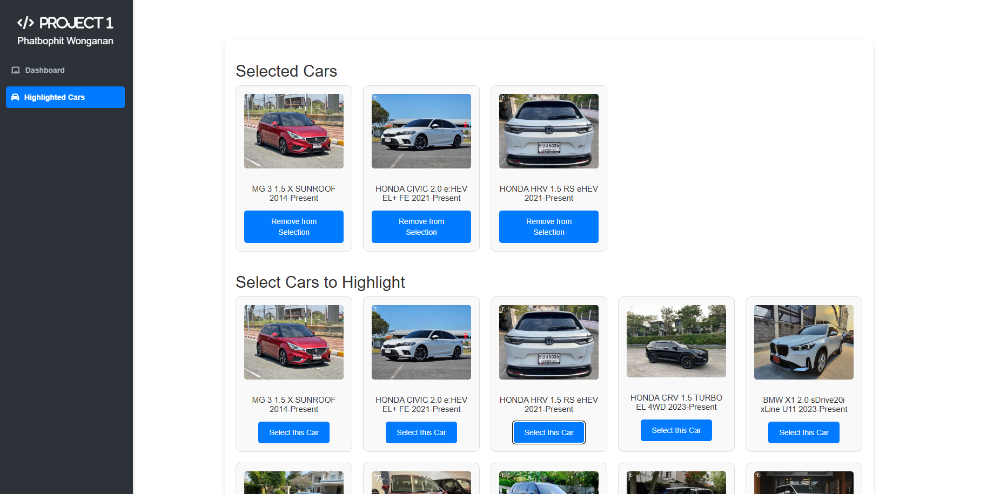

# Project-1 description
## Overview

>In this project, I am working on the "Car Market Analytics" web application using Vite React base and Chartjs to visualize the chart from provided JSON files. Moreover, I used the Bootstrap CSS framework and the Font Awesome library for styling my Car Market Analytics application. And using React Router to create a browser-based router function.

## Features
> This web application has two pages, which are the dashboard page and the highlighted cars page, attached with a sidebar to navigate between pages. 
> - Dashboard page 
> 	1. I developed the data table that query the results by showing the number of cars and values(in Bath) by brands and models.
>
> 	2. A Pie Chart that showing the portion of cars by brand base on JSON file.
> 	
> 	3. A Stacked bar Chart showing the models of a brand in a bar.
> 	
> - Highlighted Cars page 
>  	
>  	1. This page shows highlighted cars. 
>  	
>  	2. You can select a car in the list by pressing the button, and items will be shown in the highlighted section.
>  	
>  	3. Can remove the selected car by pressing the button. 
>  	
>  	4. On reload, the highlighted items persists.

# Screenshots 
## Dashboard page

## Highlighted page

> Selected cars section

### _Phatbophit Wonganan_

